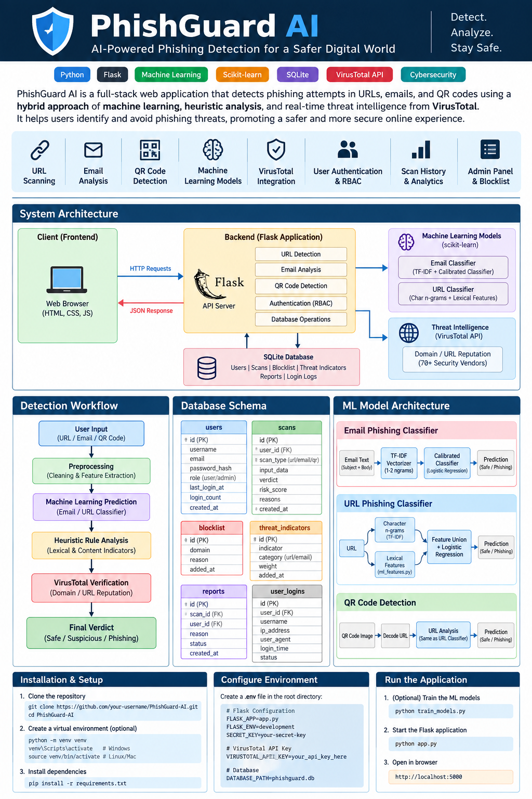

<div align="center">

# PhishGuard AI

### AI-Assisted Phishing Detection & Security Analysis Platform

A Flask-based cybersecurity application that analyzes **URLs, emails, and QR-code destinations** using local machine-learning models, deterministic security heuristics, blocklist intelligence, and optional VirusTotal enrichment.

<br>


</div>

---

## Overview

**PhishGuard AI** is a web-based phishing detection and security analysis system built around a hybrid detection pipeline.

Instead of relying on a single technique, the application combines:

- **Local machine learning** for URL and email classification
- **Deterministic heuristics** for known phishing patterns and suspicious structures
- **Threat indicators and blocklists** stored in SQLite
- **VirusTotal v3** as optional external threat-intelligence enrichment
- **Authentication, role-based access control, audit logging, and reporting**
- **Transparent scan results** that distinguish ML predictions from heuristic fallback results

The project is intended as a **cybersecurity engineering and machine-learning project**, with an emphasis on explainability, modularity, privacy-conscious inference, and practical web security workflows.

> **Current status:** Functional project / research prototype. Review the security notes and known limitations before exposing it to untrusted public traffic.

---

## Contents

- [What the Project Does](#what-the-project-does)
- [Key Capabilities](#key-capabilities)
- [Architecture](#architecture)
- [Detection Pipeline](#detection-pipeline)
- [Machine-Learning Models](#machine-learning-models)
- [Threat Intelligence](#threat-intelligence)
- [Security & Access Control](#security--access-control)
- [Data Model](#data-model)
- [Project Structure](#project-structure)
- [Technology Stack](#technology-stack)
- [Getting Started](#getting-started)
- [Configuration](#configuration)
- [Running the Application](#running-the-application)
- [Training the Models](#training-the-models)
- [API Overview](#api-overview)
- [Administration CLI](#administration-cli)
- [Detection Result Format](#detection-result-format)
- [Security Notes](#security-notes)
- [Known Limitations](#known-limitations)
- [Future Improvements](#future-improvements)
- [Project Scope](#project-scope)

---

## What the Project Does

PhishGuard accepts potentially suspicious content and produces a structured risk assessment.

### Supported inputs

| Input | Analysis |
|---|---|
| URL | Lexical analysis, ML classification, heuristic indicators, blocklist checks, optional VirusTotal enrichment |
| Email | Subject/body analysis, phishing-language indicators, embedded URL analysis, ML classification |
| QR destination | Decoded QR content is passed through the URL detection pipeline |

### Result categories

Every scan is classified into one of three application-level verdicts:

- `safe`
- `suspicious`
- `phishing`

The application also returns a numeric `risk_score` from **0–100**.

---

## Key Capabilities

### Detection

- URL phishing detection
- Email phishing detection
- QR-code destination analysis
- Local ML inference using scikit-learn
- Rule-based fallback when ML artifacts are unavailable
- Suspicious URL structure detection
- Phishing keyword and phrase indicators
- Domain blocklist checks
- Human-readable detection explanations

### Security & Accounts

- User registration and login
- Password hashing through Werkzeug
- Session-based authentication
- Server-side authorization decorators
- User / analyst / admin role model in application logic
- Login audit records
- Per-user scan history and report visibility
- Administrative user management

### Security Operations

- Threat indicator management
- Domain blocklist management
- User-submitted threat reports
- Report review statuses
- Detection analytics
- AI engine health/status endpoint
- VirusTotal integration status endpoint

---

## Architecture

The repository includes a generated architecture visual rather than relying on ASCII or Mermaid diagrams.

<p align="center">
  
</p>

The detailed architecture visual is available in `docs_phishguard_architecture.png`.

---

## Detection Pipeline

PhishGuard follows a layered analysis strategy.

### 1. Input validation

The Flask API validates the submitted scan payload and normalizes the input used by the detection engine.

### 2. Heuristic analysis

Deterministic checks look for indicators such as:

- Suspicious URL patterns
- Raw IP addresses
- `@`-based URL redirection patterns
- Suspicious top-level domains
- Authentication-related keywords
- Excessive URL length
- Hyphen-heavy or unusual lexical structures
- Known phishing phrases
- Multiple embedded links in emails
- Suspicious embedded URLs
- Domains present in the local blocklist

### 3. Local ML inference

When model artifacts are available, the appropriate scikit-learn classifier generates a probability and model-level verdict.

### 4. Threat-intelligence enrichment

For URL-oriented analysis, VirusTotal can provide additional external reputation information when configured.

### 5. Result composition

The application returns the individual ML, heuristic, and threat-intelligence signals together with a final risk score and verdict.

This makes the result easier to inspect than a single unexplained classification.

---

## Machine-Learning Models

PhishGuard currently contains two serialized local scikit-learn pipelines.

### URL classifier

Model artifact:

```text
models/url_phishing_detector.joblib
```

The URL pipeline combines:

- Character-level TF-IDF features
- Character n-grams with `ngram_range=(3, 5)`
- Custom lexical/statistical features
- Calibrated Logistic Regression

The custom feature transformer includes signals such as:

- Character entropy
- Raw IP-address detection
- `@` redirect indicators
- Suspicious TLD indicators
- Hyphen count
- Authentication/security keywords
- URL/domain structure features

The model is designed to identify lexical patterns associated with phishing URLs, including obfuscation and brand-spoofing characteristics.

### Email classifier

Model artifact:

```text
models/email_phishing_detector.joblib
```

The email pipeline uses:

- TF-IDF vectorization
- Word and phrase n-grams
- `ngram_range=(1, 2)`
- Sublinear term-frequency scaling
- Case normalization
- Calibrated Logistic Regression
- Balanced class weighting

The model is trained to identify language patterns commonly associated with social-engineering attempts, such as urgency, account restrictions, credential requests, payment requests, and other phishing-style messages.

### Model metadata

```text
models/model_metadata.json
```

The metadata file stores information about the trained model artifacts and training results generated by `train_models.py`.

> The repository should not advertise a model accuracy number unless that number is backed by a reproducible evaluation on a clearly documented test set.

---

## Hybrid Detection & Graceful Fallback

A key design feature is that the application does **not** claim an ML prediction when the ML model was not actually used.

When the models are available, a response can contain:

```json
{
  "engine_mode": "hybrid_ai",
  "ai_powered": true,
  "model_loaded": true,
  "model_probability": 0.87,
  "model_verdict": "phishing"
}
```

If model loading or inference is unavailable, the application can fall back to deterministic analysis:

```json
{
  "engine_mode": "heuristic_fallback",
  "ai_powered": false,
  "model_probability": null
}
```

This separation is important for transparent reporting and debugging.

---

## Threat Intelligence

### VirusTotal

PhishGuard optionally integrates with the **VirusTotal v3 API**.

The integration can be used to:

- Check URL/domain reputation
- Retrieve vendor detection statistics
- Identify malicious or suspicious classifications
- Add external threat-intelligence context to the local analysis
- Cache repeated lookups for a limited period

The integration is implemented in:

```text
virustotal_client.py
```

VirusTotal is an enrichment layer. It does not replace the local ML and heuristic detection pipeline.

If no API key is configured, the core local detection functionality can still operate.

---

## Security & Access Control

The application implements server-side authentication and authorization.

### Application roles

| Role | Intended capabilities |
|---|---|
| `user` | Scan content, view personal history, submit reports |
| `analyst` | Security analysis and analyst-oriented views |
| `admin` | Administrative console, user management, blocklists, reports, system analytics |

Authorization is handled in the Flask backend through decorators including:

```python
@login_required
@admin_required
@analyst_required
```

### User data isolation

The application is designed to restrict normal users to their own:

- Scan history
- Submitted reports
- Login audit records

Administrative roles can access broader operational data according to the endpoint.

### Password handling

Passwords are stored as Werkzeug password hashes rather than plaintext passwords.

---

## Data Model

PhishGuard uses SQLite for local persistence.

Main tables:

| Table | Purpose |
|---|---|
| `users` | Accounts, roles, login metadata |
| `scans` | URL, email and QR scan records |
| `blocklist` | Known-bad domains/URLs |
| `threat_indicators` | Reusable phishing patterns and weights |
| `reports` | User-submitted threat reports |
| `user_logins` | Login audit records |

The schema is defined in:

```text
schema.sql
```

Database operations and migrations are handled by:

```text
database.py
```

The application also performs non-destructive schema initialization/migration logic for fields such as login metadata and roles.

---

## Project Structure

A simplified repository layout is:

```text
PhishGuard AI/
│
├── app.py
├── ai_detector.py
├── ml_features.py
├── database.py
├── virustotal_client.py
├── train_models.py
├── manage.py
├── schema.sql
├── requirements.txt
├── .env.example
├── .gitignore
│
├── models/
│   ├── email_phishing_detector.joblib
│   ├── url_phishing_detector.joblib
│   └── model_metadata.json
│
└── frontend/
    ├── landing.html
    ├── index.html
    ├── login.html
    ├── register.html
    ├── reports.html
    ├── admin.html
    └── script.js
```

Additional frontend assets and pages may exist in the repository depending on the current UI build.

---

## Technology Stack

### Backend

- Python
- Flask
- Flask-CORS
- Werkzeug
- SQLite

### Machine Learning

- scikit-learn
- NumPy
- Joblib
- TF-IDF
- Logistic Regression
- Calibrated classification
- Custom feature transformer

### Threat Intelligence

- VirusTotal v3 API
- Local blocklist
- Local threat-indicator dictionary

### Frontend

- HTML
- CSS
- JavaScript

### Configuration

- `python-dotenv`
- Environment variables

---

# Getting Started

## Prerequisites

Recommended environment:

- Python **3.10 or newer**
- Git
- A terminal / PowerShell
- Optional: VirusTotal API key

---

## 1. Clone the repository

```bash
git clone <your-repository-url>
cd <your-repository-directory>
```

If the project is already downloaded, simply open the project directory in your IDE.

---

## 2. Create a virtual environment

### Windows

```powershell
python -m venv .venv
.venv\Scripts\activate
```

### macOS / Linux

```bash
python3 -m venv .venv
source .venv/bin/activate
```

---

## 3. Install dependencies

```bash
pip install -r requirements.txt
```

Current core dependencies include:

```text
Flask
Flask-Cors
scikit-learn
joblib
numpy
python-dotenv
requests
```

---

## Configuration

Create a local `.env` file from the supplied example:

```bash
copy .env.example .env
```

or on macOS/Linux:

```bash
cp .env.example .env
```

Example configuration:

```ini
SECRET_KEY=replace-with-a-long-random-secret
FLASK_HOST=127.0.0.1
FLASK_PORT=5000
FLASK_DEBUG=0

DATABASE_PATH=phishguard.db

PHISHGUARD_OFFLINE_INFERENCE=true

# Optional
VIRUSTOTAL_API_KEY=

# Optional external AI provider configuration
PHISHGUARD_AI_PROVIDER=
PHISHGUARD_API_KEY=
```

### Important

Never commit `.env` to Git.

Secrets, API keys, private credentials, production session keys, and database files should remain outside version control.

---

## Running the Application

Start the Flask application with:

```bash
python app.py
```

By default, the project is configured around:

```text
http://127.0.0.1:5000
```

The application initializes the SQLite database when the backend starts.

For development, you can enable Flask debug mode locally. Do **not** use debug mode as a production deployment configuration.

---

## Training the Models

The training entry point is:

```bash
python train_models.py
```

The script generates:

```text
models/
├── email_phishing_detector.joblib
├── url_phishing_detector.joblib
└── model_metadata.json
```

The training script currently contains the training corpus and evaluation workflow used by the project.

For serious research or deployment use, the training data should be expanded, versioned, independently validated, and evaluated against a held-out test set.

---

## API Overview

### Health & engine status

| Method | Endpoint | Purpose |
|---|---|---|
| `GET` | `/api/health` | Backend and AI engine health |
| `GET` | `/api/ai/status` | Local ML engine status |
| `GET` | `/api/virustotal/status` | VirusTotal integration status |
| `GET` | `/api/database/info` | Database telemetry |

### Authentication

| Method | Endpoint | Purpose |
|---|---|---|
| `POST` | `/api/auth/register` | Register an account |
| `POST` | `/api/auth/login` | Authenticate a user |
| `POST/GET` | `/api/auth/logout` | End the current session |
| `GET` | `/api/auth/me` | Get the current session/user |
| `GET` | `/api/auth/logins` | Get the authenticated user's login audit records |

### Detection

| Method | Endpoint | Purpose |
|---|---|---|
| `POST` | `/api/scan/url` | Analyze a URL |
| `POST` | `/api/scan/email` | Analyze email subject/body |
| `POST` | `/api/scan/qr` | Analyze a QR destination |
| `GET` | `/api/scan/<scan_id>` | Retrieve a stored scan |
| `GET` | `/api/history` | Retrieve scan history |
| `GET` | `/api/stats` | Detection statistics |
| `GET` | `/api/analytics` | Detection analytics |

### Threat intelligence & reports

| Method | Endpoint | Purpose |
|---|---|---|
| `GET/POST` | `/api/indicators` | Read/add threat indicators |
| `DELETE/POST` | `/api/indicators/<id>` | Remove an indicator |
| `POST` | `/api/reports` | Submit a threat report |
| `GET` | `/api/reports` | List reports according to user role |
| `GET` | `/api/reports/<id>` | Retrieve a report |
| `PATCH/POST` | `/api/reports/<id>/status` | Update report status |

### Example: URL scan

Request:

```http
POST /api/scan/url
Content-Type: application/json
```

```json
{
  "url": "https://example.com/login"
}
```

The response can include:

```json
{
  "success": true,
  "verdict": "safe",
  "risk_score": 12,
  "engine_mode": "hybrid_ai",
  "ai_powered": true,
  "model_probability": 0.03,
  "model_verdict": "safe",
  "heuristic_score": 12,
  "reasons": []
}
```

Exact response values depend on the supplied input and current model/database state.

---

## Detection Result Format

The backend exposes several fields so the frontend can distinguish the different analysis layers.

| Field | Meaning |
|---|---|
| `verdict` | Final application verdict |
| `risk_score` | Combined risk score, 0–100 |
| `engine_mode` | Detection mode, such as `hybrid_ai` or `heuristic_fallback` |
| `ai_powered` | Whether a local ML model produced the current model assessment |
| `model_loaded` | Whether the relevant model is loaded |
| `model_name` | Model identifier |
| `model_probability` | ML probability when inference is available |
| `model_verdict` | ML-only classification |
| `model_score` | ML score expressed as a percentage-style integer |
| `model_explanation` | Human-readable model explanation |
| `heuristic_score` | Deterministic rule-based score |
| `heuristic_reasons` | Reasons triggered by heuristic analysis |
| `virustotal` | Optional external threat-intelligence result |
| `reasons` | Combined reasons shown to the user |

---

## Administration CLI

The repository includes `manage.py` for server-owner account management.

### List users

```bash
python manage.py list-users
```

### Promote a user to administrator

```bash
python manage.py promote-admin <username>
```

### Demote an administrator

```bash
python manage.py demote-admin <username>
```

### Create an administrator

```bash
python manage.py create-admin <username> <email> <password>
```

Administrative privileges should be granted only through a trusted administrative workflow.

---

## Security Notes

This project is security-focused, but the application itself should still be treated as a **prototype until independently hardened and tested**.

### Before publishing the repository

- [ ] Remove all real API keys from `.env`
- [ ] Rotate/revoke any API key that has already been exposed
- [ ] Ensure `.env` is listed in `.gitignore`
- [ ] Replace development `SECRET_KEY`
- [ ] Remove or secure seeded demo accounts
- [ ] Disable Flask debug mode
- [ ] Review CORS configuration
- [ ] Review session cookie settings for deployment
- [ ] Put the application behind HTTPS in production
- [ ] Add rate limiting to authentication and scan endpoints
- [ ] Add request-size limits
- [ ] Validate and sanitize all external inputs
- [ ] Review authorization on every administrative endpoint
- [ ] Run dependency and static-security scans
- [ ] Do not commit `phishguard.db` if it contains real user data

### Important repository-specific warning

The supplied project files contain an API credential in the local `.env` file and a fallback credential in `virustotal_client.py`.

**Do not publish those values. Revoke/rotate the exposed credential and replace the implementation with environment-only secret loading before pushing the project to a public Git repository.**

---

## Known Limitations

### Model/data limitations

The current training implementation is a project-level prototype rather than a production-scale threat-detection dataset.

Potential limitations include:

- Limited training corpus
- Limited representation of real-world phishing campaigns
- No guarantee against previously unseen attack techniques
- Potential false positives and false negatives
- Model performance may differ substantially on external datasets
- No independent benchmark against a production phishing-detection service

### Application limitations

Before production deployment, the project should receive additional security testing around:

- Authentication abuse
- Authorization coverage
- CSRF protection
- Session security
- Rate limiting
- Input validation
- CORS policy
- API abuse
- Secret management
- Logging and monitoring
- Dependency vulnerabilities

### Role/schema consistency

The application code supports `user`, `analyst`, and `admin` roles, while the supplied SQLite schema contains a role constraint that lists `user` and `admin`.

This should be reconciled before treating the role system as production-ready.

---

## Future Improvements

Potential next steps include:

### Machine learning

- Expand the phishing training corpus
- Add real-world and continuously refreshed datasets
- Introduce proper train/validation/test separation
- Add cross-validation
- Track precision, recall, F1, ROC-AUC and PR-AUC
- Perform threshold calibration
- Add model versioning
- Add explainability methods such as feature contribution analysis
- Evaluate robustness against adversarial URL obfuscation

### Security engineering

- Add rate limiting
- Add CSRF protection where appropriate
- Strengthen session-cookie configuration
- Add security headers
- Improve audit logging
- Add automated dependency scanning
- Add unit and integration test coverage
- Add authorization tests for every privileged endpoint

### Platform

- Docker deployment
- Production WSGI server
- PostgreSQL support
- Background threat-intelligence jobs
- Centralized logging
- SIEM integration
- API documentation with OpenAPI/Swagger
- CI/CD pipeline
- Monitoring and alerting

### Detection capabilities

- Attachment analysis
- HTML/page-content analysis
- Domain-age and WHOIS enrichment
- DNS-based signals
- Redirect-chain analysis
- Screenshot-based website analysis
- QR image decoding directly in the backend
- Browser extension integration

---

## Project Scope

PhishGuard AI demonstrates how traditional machine learning, deterministic security controls, threat intelligence, and web application engineering can be combined into a single phishing-analysis platform.

The project is particularly suitable for:

- Cybersecurity coursework
- Machine-learning demonstrations
- Web-security projects
- Hackathon prototypes
- Security research experimentation
- Portfolio demonstrations
- Further development into a larger security-analysis platform

It should **not** be treated as a standalone security control or as a guarantee that a website, email, or QR destination is safe.

---

## Contributing

If you plan to continue developing the project:

1. Create a feature branch.
2. Keep secrets and local databases out of commits.
3. Add or update tests for security-sensitive changes.
4. Document new API endpoints and configuration.
5. Run the application locally before submitting changes.
6. Submit a pull request with a concise explanation of the change.

---

## License

Add the repository's chosen license here before publishing.

For example:

```text
MIT License
```

If a `LICENSE` file already exists in the repository, keep this section consistent with that file.

---

## Acknowledgements

- Flask — web application framework
- scikit-learn — machine-learning toolkit
- SQLite — local relational database
- VirusTotal — optional threat-intelligence enrichment
- Python ecosystem — supporting libraries and tooling

---

<div align="center">

### PhishGuard AI

**Detect. Analyze. Explain.**

Built as a cybersecurity and machine-learning engineering project.

</div>
